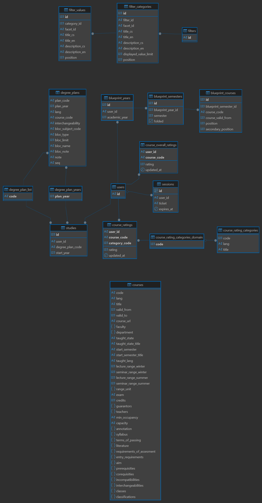

# Data Model

- [Data Model](#data-model)
  - [Source](#source)
  - [Target](#target)
    - [MeiliSearch](#meilisearch)
      - [degree\_plans](#degree_plans)
      - [survey](#survey)
      - [courses](#courses)
    - [PostgreSQL](#postgresql)
      - [Course](#course)
      - [Blueprint](#blueprint)
      - [Degree plan](#degree-plan)
      - [Session](#session)
      - [Studies](#studies)
      - [Rating](#rating)

## Source

The source data model is already partially preprocessed SIS data model. It is presented to us in form of Oracle synonyms and tables. Because the the schema is also used by another application with different needs we don't use all the synonyms. Below is a list of synonyms, tables and one package which are currently used by RecSIS (The names are meaningful acronyms in czech language).  

 - UCIT - Basic info about teachers.
 - FAK - Basic info about faculty. 
 - POVINN - Basic info about course.
 - PAMELA - Description of course such as annotation or syllabus.
 - POVINN2JAZYK - POVINN supports storing only one language in which course is taught. POVINN2JAZYK provides additional languages in which course is taught. 
 - UCIT_ROZVRH - Maps course to teachers for academic year and semester. 
 - ANKECY - Written survey results with anonymized data about author.
 - PKLAS - Maps course to classification.
 - PTRIDA - Maps course to class.
 - PREQ - Maps course to different types of requisities. The requisities are usually simple course codes. But they can be also something more complicated. For example course NPRG041 has disjunctive prerequisities. In the table it is still represented as single course code N#IA028. N#IA028 also exists in table POVINN. Currently we don't know to translate such requisite correctly. 
 - JAZYK - Maps language code to label.
 - KLAS - Maps Classification code to label.
 - TRIDA - Maps Class code to label and faculty.
 - DRUH - Maps study type (Bc, Mgr, ...) code to label.
 - TYPYPOV - Maps course examination type code to label.
 - SEKCE - Maps	section (informatics/mathematics/...) code to label and faculty.
 - USTAV - Maps department code to label, faculty and section.
 - RVCEM - Maps lecture/seminar range unit code to label.
 - ZSEM - Maps semester code to label.
 - PVYUC - Maps course state (taught/cancelled/...) to label.
 - TYPMEM - Maps course description (annotation, ...) type code to label.
 - OBOR - Basic info about study field. 
 - STUDPLAN - This is an Oracle database package. By providing degree plan code and academic year it returns degree plan. For example `SELECT * FROM TABLE(study_plan.stud_plan('NISD23N', 2023));`. The RecSIS currently doesn't work with BLOC_GRADE column which indicates recommended year of study. It is possible that in the results are more useful columns that are currently not used. It would be great to investigate it more and implement more features related to degree plan in RecSIS. 

We have also access to two more tables which will be useful in the future for more advanced recommendation engine.
 - STUDIUM - Anonymized basic info about student study.
 - ZKOUS - Binary results of student exams.

 For better understanding of the source data model we encourage you to connect to the SIS database and explore the data. The best way is to simply select few rows from a table and see what is inside. More insight can be found by quering table "tabulky" - for example to get info about table POVINN `SELECT * FROM tabulky WHERE tabulka='POVINN'`. Be aware that the result is for a table and not the synonyms - it is possible that not all synonyms are existing tables.

 Currently we can't access personal data of a student. This is something that we are working on. Getting access at least to basic info about student such as year of enrollment and degree plan would allow us to simplify degree plan UI and improve degree plan UX. We would also like to get access to complete courses to automatically populate blueprint with correct historical data. 

## Target

There are two target models. One is stored in PostgreSQL and the second one in MeiliSearch. The later is used only for searching courses, degree plans and surveys. There is no synchronization between the two models. The data in MeiliSearch cannost be changed by webapp and are only updated by ELT process. The MeiliSearch data model consists of three indixes - courses, degree_plans and surveys. The courses index is used to search in courses and only to retrieve relevant course codes. Rest of the data is then fetched from PostgreSQL - call to PostgreSQL would have to been made anyway since blueprint is stored there and by this we don't have to combine results from the two sources. 

### MeiliSearch

The degree_plans index is used to search in degree plans. The surveys index is used to search in surveys. Both degree_plans and surveys indexes has all the data needed to display search results. Exact configurtation (including synonyms definition, filterable values and others) can be seen in [init-meili](../scripts/init-meili.ps1). Below are examples of documents stored in each index.

#### degree_plans 
```json
{
  "id": "number - unique identifier",
  "code": "string - degree plan code",
  "study_type": "string - Bc, NMgr, ...",
  "title": "string - title of of associated study field",
}
```

#### survey  
```json
{
  "id": "number - unique identifier",
  "course_code": "string - course code",
  "academic_year": "number - academic year when the survey was filled",
  "study_year": "number - year of study of the author",
  "target_type": "string - lecture/seminar/...",
  "content": "string - content of the survey",
  "study_field": {
    "id": "string - study field code",
    "name": {
      "cs": "string - study field name in czech",
      "en": "string - study field name in english"
    }
  },
  "study_type": {
    "id": "string - study type code",
    "abbr": {
      "cs": "string - study type abbreviation in czech",
      "en": "string - study type abbreviation in english"
    },
    "name": {
      "cs": "string - study type name in czech",
      "en": "string - study type name in english"
  },
  "teacher": {
    "id": "number - SIS id",
    "first_name": "string - teacher first name",
    "last_name": "string - teacher last name",
    "title_before": "string - teacher title before name",
    "title_after": "string - teacher title after name"
  }
}
```

#### courses  
```json
{
  "id": "number - SIS id",
  "code": "string - course code",
  "credits": "number - course credits",
  "start_semester": "string - semester code when the course starts",
  "semester_count": "number - duration of the course in semesters",
  "taught_state": "string - course state code (represents taught/cancelled/...)",
  "exam": [
    "string - exam type code for winter semester",
    "string - exam type code for summer semester",
  ],
  "range_unit": "string - lecture/seminar range unit code (HT/...)",
  "faculty": "string - faculty code",
  "department": "string - department code (32-KSI/...)",
  "section": "string - section code (represents informatics/mathematics/...)",
  "taught_lang": [
    "string - language code in which the course is taught"
  ],
  "lecture_range": [
    "number - lecture range for winter semester",
    "number - lecture range for summer semester",
  ],
  "seminar_range": [
    "number - seminar range for winter semester",
    "number - seminar range for summer semester",
  ], 
  "guarantors": [
    {
      "first_name": "string - teacher first name",
      "last_name": "string - teacher last name",
    }
  ],
  "teachers": [
    {
      "first_name": "string - teacher first name",
      "last_name": "string - teacher last name",
    }
  ],
  "title": {
    "cs": "string - course title in czech",
    "en": "string - course title in english"
  },
  "annotation": [
    "string - course annotation in czech",
    "string - course annotation in english"
  ],
  "syllabus": [
    "string - course syllabus in czech",
    "string - course syllabus in english"
  ],
  "terms_of_passing": [
    "string - course terms of passing in czech",
    "string - course terms of passing in english"
  ],
  "literature": [
    "string - course literature in czech",
    "string - course literature in english"
  ],
  "requirements_of_assesment": [
    "string - course requirements of assesment in czech",
    "string - course requirements of assesment in english"
  ],
  "aim": [
    "string - course aim in czech",
    "string - course aim in english"
  ],
}
```

### PostgreSQL

Data model of PostgreSQL is bit more complex but still fairly simple as can be seen in the diagram below. It's definition can be seen in [30-create-tables.sql](../init_db/30-create-tables.sql). The tables populated by elt are courses, filters, filter_categories, filter_values, degree_plans, degree_plan_list and degree_plan_years. In those tables are stored data about courses and degree plans. Those tables are not expected to be updated by any other part of the system. we tried make those tables as simple as possible since we do not update them and most of the values are only to be viewed by users. Other tables are on the other hand updated only by the webapp. Their purpose is to store application specific data such as courses added to blueprint, course ratings and user sessions.



#### Course 

**Relevant tables:** courses  
All data about courses are stored in a single table. Each language variant (cs, en) is stored on a single row - meaning each course is represented by two rows. Denormalization with PostgreSQL support for storing JSONB data allows us to keep all course-related information in together, making it easier to manage and query. The disadvantage of this approach is that in case of extending the RecSIS by richer support for teachers the data model may need to be re-evaluated to reflect better the usage of the data. 

#### Blueprint

**Relevant tables:** *blueprint_years, blueprint_semesters, blueprint_courses*  
Blueprint data are properly normalized across these tables. The motivation behind this design is to allow for flexible querying and reporting on the blueprint structure. We also decided to store unassigned courses in this table structure under *blueprint_years.academic_year = 0*. So every user will have at least one record in *blueprint_years* table to represent unassigned blueprint courses. 

#### Degree plan

**Relevant tables:** *degree_plans, degree_plan_list, degree_plan_years*  
Degree plan is stored also denormalized to allow easier querying. To ensure valid degree plans stored in *studies* plan we created *degree_plan_list* and *degree_plan_years* tables. The first one stores all valid degree plans and the second one stores all valid academic years. This allows us to validate user input when user selects his/her degree plan and academic year.

#### Session

**Relevant tables:** *sessions*  
To store session key used to authenticate logged users. The token references token used when authenticating user via CAS. To learn more about it see [CAS documentation](https://apereo.github.io/cas/).

#### Studies

**Relevant tables:** *studies*  
To store studies related information about a user. This includes study plan and year of enrollemnt.

#### Rating

**Relevant tables:** *course_ratings, course_rating_categories_domain, course_rating_categories, course_overall_ratings*  
Table *course_overall_ratings* stores like/dislike from a user for a specific course. Tables *course_ratings*, *course_rating_categories_domain*, and *course_rating_categories* store rating for a specific category for a course. Table *course_rating_categories_domain* is preparation for supporting different rating ranges for distinct rating categories.