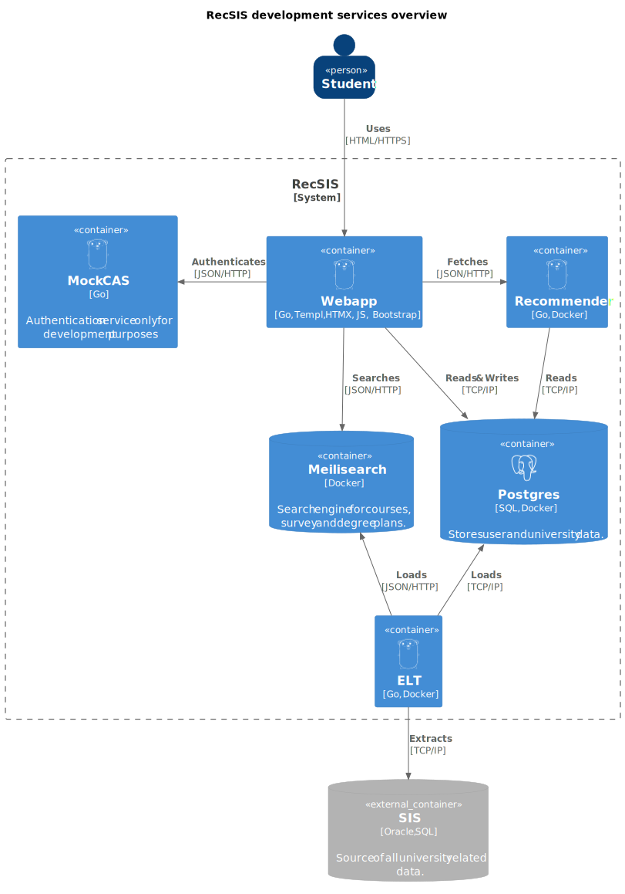

# RecSIS Development Guide

Before diving into the concrete steps of building and running RecSIS, it would
be beneficial to understand overall structure of the project. If you feel like
ignoring it for now, feel free to skip it and jump right into
[Setup](#how-to-run-recsis).

## Introduction

The RecSIS consists of several docker containers and two standalone
applications. The responsibilities can be seen in the diagram below. It's worth
noting that RecSIS is planned to be deployed in production fully dockerized but
because rebuilding webapp as a docker container is much slower the webapp as the
main application is not dockerized as it is rebuildit quite frequently in
development. The second undockerized application (Mock CAS) is a not used in
production at all and the real instance of [CAS](https://cas.cuni.cz/cas/login)
is used instead.




### Search Engine

Even though we aim to use as little technologies as possible, some are
neccessary to deliver the envisioned UX. Especially since search is a core
feature of RecSIS. After some experiments with PostgreSQL full text search
capabilities We decided to use [Meilisearch](https://www.meilisearch.com/)
because it is easy to set as opposed to for example [Apache
Solr](https://solr.apache.org/), but still provides neccessary features (e.g.:
typo tolerance) as opposed to PostgreSQL. Meilisearch wasn't the only
posibility. [Typesense](https://typesense.org/) was another candidate but we
decided to go with younger Meilisearch because it looked more shiny.

### ELT

It's worth mentioning that to access SIS DB you need to be inside MFF network.
Therfore inside the container is setuped SSH tunnel to Acheron. This is also why
you need access to Acheron server to run ELT.

### List of technologies

 - [Go](https://go.dev/) - The main language of the entire RecSIS. Should be a
 preferable choice for any implementation.
 - [HTMX](https://htmx.org/) - The core of HTMX is a set of attributes that
 allow you to issue AJAX requests directly from HTML. Brings SPA like experience
 to the SSR web apps.
 - [Templ](https://templ.guide/) - Compiler for HTML templates to minimize run
 time errors. Because the tooling is not the best we sometimes asking ourselfs
 if it was a wise choice.
 - [Bootstrap](https://getbootstrap.com/) - Simple way to style web apps.
 - [PostgreSQL](https://postgresql.org/) - Relational database of our choice
 with rich support for binary JSON format.
 - [Meilisearch](https://meilisearch.com/) - Simple and powerful search engine.
 - [Docker](https://docker.com/) - To simplify development and deployment in
 production. In development using Docker not always simplifies things so we
 thinks it is ok to not use it but in production it is a must.
 - [Adminer](https://adminer.org/) - Web based DB client deployed as a
 container.

## How to run RecSIS

### Clone repository

**Prerequisities:**
 - Member of RecSIS repo.
 - Setuped SSH for GitHub account (see [github docs](https://docs.github.com/en/authentication/connecting-to-github-with-ssh/adding-a-new-ssh-key-to-your-github-account)).

**Steps:**
```
git clone git@github.com:michalhercik/RecSIS.git
```

### Run

**Prerequisites:**
 - Cloned RecSIS repo (see [Clone](#clone)).
 - Installed Docker (see [Docker docs](https://docs.docker.com/get-docker/)).
 - Installed Go (see [Go docs](https://go.dev/doc/install)).
 - SSH key setup for Acheron (Optional)
    - Being able to access Acheron via SSH using your SSH key with private key
    located at `~/.ssh/id_rsa`.
    - This step allows you tu run ELT process which populates RecSIS with data
    from SIS.
    - The requirement can be ignored if you don't mind RecSIS witout any SIS
    data.

Before running the RecSIS you need to set environment variables required by
`docker-compose.yml` and webapp. The easiest way is to create a file named
`docker.env` with the required variables and load it in your terminal whenever
you are working with `docker compose`. All `.env` files are not tracked so don't
be afraid of password exposure. Variables needed to be set can be found in
`docker-compose.yml` file under *environment* field of each service.
Alternatively if you run the command `docker compose` it will warn you about
missing variables.

You can then load it in your terminal with the following command:

For **Windows**:

```
scripts\init-env.ps1 [.env file path]
```

For **Linux**:

```
source [.env file path]
export $(cut -d= -f1 [.env file path])
```

The next step is to run the `docker compose` command. This will build and run
the necessary containers. The command will also automatically download the
required images if they are not already present on your system.

> NOTE: If you skipped the Acheron SSH setup step you should **not** run the
**elt** service.

**Steps:**
```
docker compose up -d postgres meilisearch elt recommender mockcas adminer
```

Now that Meilisearch is running you need to configurate it using script. The
script will set aliases, filterable, sortable and searchable attributes.

For **Windows**
```
./scripts/init_meili.ps1
```

For **Linux**
```
./scripts/init_meili.sh
```

Before running the webapp you need to install [templ](https://templ.guide/) tool
which is responsible for generating HTML templates from `.templ` files.

**Steps:**
```
go install github.com/a-h/templ/cmd/templ@v0.2.793
```

Lastly you can run the webapp. The best way to do it is using watch script. The
script will automatically rebuild the webapp whenever you change any of the
source files. It also always generates HTML templates.

For **Windows**
```
./scripts/watch.ps1
```

For **Linux**
```
./scripts/watch.sh
```

If everything went well you should be able to access the webapp at
[https://localhost:8000](https://localhost:8000).

### Summary

For **Windows**:

```
# Clone RecSIS repo
git clone git@github.com:michalhercik/RecSIS.git

# Load environment variables
scripts\init-env.ps1 [.env file path]

# Build & run containers
docker compose up -d postgres meilisearch elt recommender mockcas adminer

# Init Meilisearch
./scripts/init_meili.ps1

# Install templ
go install github.com/a-h/templ/cmd/templ@v0.2.793

# Run webapp
./scripts/watch.ps1
```

For **Linux**:

```
# Clone RecSIS repo
git clone git@github.com:michalhercik/RecSIS.git

# Load environment variables
source [.env file path]
export $(cut -d= -f1 [.env file path])

# Build & run containers
docker compose up -d postgres meilisearch elt recommender mockcas adminer

# Init Meilisearch
./scripts/init_meili.sh

# Install templ
go install github.com/a-h/templ/cmd/templ@v0.2.793

# Run webapp
./scripts/watch.sh
```

## Code structure

Now that you have RecSIS up and running, it's time to explain a bit about the
webapp architecture. We created a package diagram to help you understand the
codebase and purpose of each package. 


Other services are much simpler and if needed you should be able to understand
them pretty quickly just by reading the code. Before diving into implementing
new features you should get even deeper understanding by reading at least some
of the package implementations. We suggest you to start in the main file and
then continue in any of the packages implementing page handlers (e.g.
coursedetail, courses, ...).

Happy developing!