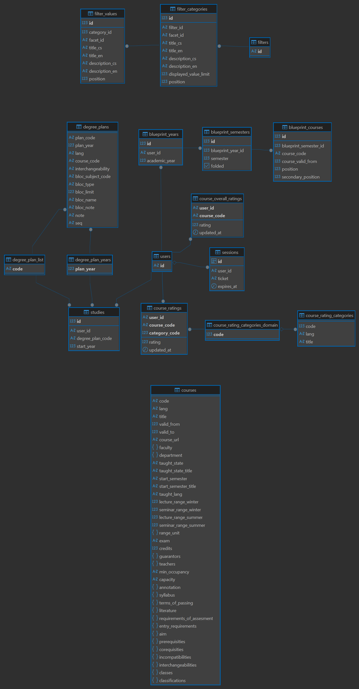

# RecSIS Development Guide

- [RecSIS Development Guide](#recsis-development-guide)
  - [Introduction](#introduction)
    - [Search Engine](#search-engine)
    - [ELT](#elt)
    - [List of technologies](#list-of-technologies)
  - [How to run RecSIS](#how-to-run-recsis)
    - [Clone repository](#clone-repository)
    - [Run](#run)
    - [Summary](#summary)
  - [Repo structure](#repo-structure)
    - [Webapp](#webapp)
    - [Bert](#bert)
    - [Cert](#cert)
    - [Docs](#docs)
    - [ELT](#elt-1)
    - [Init\_db](#init_db)
    - [Mock\_cas](#mock_cas)
    - [Scripts](#scripts)
  - [Data Model](#data-model)
    - [Source](#source)
    - [Target](#target)
  - [Testing](#testing)
  - [How to extend this application](#how-to-extend-this-application)
    - [Add new page](#add-new-page)
    - [Add a filter](#add-a-filter)
    - [Add a recommender](#add-a-recommender)
    - [Add error configuration](#add-error-configuration)
    - [Use `LangString`s](#use-langstrings)
  - [Contact](#contact)

Before diving into the concrete steps of building and running RecSIS, it would
be beneficial to understand overall structure of the project. If you feel like
ignoring it for now, feel free to skip it and jump right into
[Setup](#how-to-run-recsis).

## Introduction

The RecSIS consists of several docker containers and two standalone
applications. The responsibilities can be seen in the diagram below. It's worth
noting that RecSIS is planned to be deployed in production fully dockerized but
because rebuilding [webapp](#webapp) as a docker container is much slower,
the webapp is not dockerized as it is the main application and is rebuild quite
frequently in development. The second undockerized application
([Mock CAS](#mock_cas)) is a not used in production at all and the real
instance of [CAS](https://cas.cuni.cz/cas/login) is used instead.


### Search Engine

Even though we aim to use as little technologies as possible, some are
necessary to deliver the envisioned UX. Especially since search is a core
feature of RecSIS. After some experiments with PostgreSQL full text search
capabilities we decided to use [Meilisearch](https://www.meilisearch.com/)
because it is easy to set as opposed to, for example [Apache
Solr](https://solr.apache.org/), but still provides necessary features (e.g.
typo tolerance) as opposed to PostgreSQL. Meilisearch wasn't the only
possibility. [Typesense](https://typesense.org/) was another candidate but we
decided to go with younger Meilisearch because it looked more shiny.

### ELT

It's worth mentioning that to access SIS DB you need to be inside MFF network.
Therefore, a SSH tunnel to Acheron is set up inside the container. This is also why
you need access to Acheron server to run ELT.

### List of technologies

 - [Go](https://go.dev/) - The main language of the entire RecSIS. Should be a
 preferable choice for any implementation.
 - [HTMX](https://htmx.org/) - The core of HTMX is a set of attributes that
 allow you to issue AJAX requests directly from HTML. Brings SPA like experience
 to the SSR web apps.
 - [Templ](https://templ.guide/) - Compiler for HTML templates to minimize run
 time errors. Because the tooling is not the best we sometimes asking ourselves
 if it was a wise choice.
 - [Bootstrap](https://getbootstrap.com/) - Simple way to style web apps.
 - [Python](https://www.python.org/) - We use Python for creating BERT embeddings for courses. This is used by MeiliSearch for recommendations.
 - [PostgreSQL](https://postgresql.org/) - Relational database of our choice
 with rich support for binary JSON format.
 - [Meilisearch](https://meilisearch.com/) - Simple and powerful search engine.
 - [Docker](https://docker.com/) - To simplify development and deployment in
 production. In development using Docker not always simplifies things so we
 thinks it is ok to not use it but in production it is a must.
 - [Adminer](https://adminer.org/) - Web based DB client deployed as a
 container.

## How to run RecSIS

### Clone repository

**Prerequisites:**
 - Member of RecSIS repo.
 - Set up SSH for GitHub account (see [github docs](https://docs.github.com/en/authentication/connecting-to-github-with-ssh/adding-a-new-ssh-key-to-your-github-account)).

**Steps:**
```
git clone git@github.com:michalhercik/RecSIS.git
```

### Run

**Prerequisites:**
 - Cloned RecSIS repo (see [Clone](#clone-repository)).
 - Installed Docker (see [Docker docs](https://docs.docker.com/get-docker/)).
 - Installed Go (see [Go docs](https://go.dev/doc/install)).
 - SSH key setup for Acheron (Optional)
    - Being able to access Acheron via SSH using your SSH key with private key
    located at `~/.ssh/id_rsa`.
    - This step allows you tu run ELT process which populates RecSIS with data
    from SIS.
    - The requirement can be ignored if you don't mind RecSIS without any SIS
    data.

Before running the RecSIS you need to set environment variables required by
`docker-compose.yml` and webapp. The easiest way is to create a file named
`docker.env` with the required variables and load it in your terminal whenever
you are working with `docker compose`. All `.env` files are not tracked so don't
be afraid of password exposure. Variables needed to be set can be found in
`docker-compose.yml` file under *environment* field of each service.
Alternatively if you run the command `docker compose` it will warn you about
missing variables.

All environment variables with `_PASS` suffix (except `SIS_DB_PASS`) and `MEILI_MASTER_KEY` can be set to any string you want. The string will be used as a password for the corresponding service. Same goes for `POSTGRES_USER` and `POSTGRES_PASSWORD`. `SIS_DB_USER`, `SIS_DB_PASS` and `ACHERON_USER` must be set correctly and if you need them, please contact us at [recsis@email.cz](mailto:recsis@email.cz).

You can then load it in your terminal with the following command:

For **Windows**:

```
scripts\init-env.ps1 [.env file path]
```

For **Linux**:

```
source [.env file path]
export $(cut -d= -f1 [.env file path])
```

The next step is to run the `docker compose` command. This will build and run
the necessary containers. The command will also automatically download the
required images if they are not already present on your system.

> NOTE: If you skipped the Acheron SSH setup step you should **not** run the
**elt** service.

**Steps:**
```
docker compose up -d postgres meilisearch elt bert mockcas adminer
```

Now that Meilisearch is running you need to configure it using script. The
script will set aliases, filterable, sortable and searchable attributes.

For **Windows**
```
.\scripts\init-meili.ps1
```

For **Linux**
```
./scripts/init-meili.sh
```

Before running the webapp you need to install [templ](https://templ.guide/) tool
which is responsible for generating HTML templates from `.templ` files
and [wgo](https://github.com/bokwoon95/wgo) which watches live changes in the source files and rebuilds the webapp.

**Steps:**
```
go install github.com/a-h/templ/cmd/templ@v0.2.793
go install github.com/bokwoon95/wgo@latest
```

Lastly you can run the webapp. The best way to do it is using watch script. The
script will automatically rebuild the webapp whenever you change any of the
source files. It also always generates HTML templates.

For **Windows**
```
.\scripts\watch.ps1
```

For **Linux**
```
./scripts/watch.sh
```

If everything went well you should be able to access the webapp at
[https://localhost:8000](https://localhost:8000).

### Summary

For **Windows**:

```
# Clone RecSIS repo
git clone git@github.com:michalhercik/RecSIS.git

# Load environment variables
scripts\init-env.ps1 [.env file path]

# Build & run containers
docker compose up -d postgres meilisearch elt bert mockcas adminer

# Init Meilisearch
.\scripts\init-meili.ps1

# Install templ and wgo
go install github.com/a-h/templ/cmd/templ@v0.2.793
go install github.com/bokwoon95/wgo@latest

# Run webapp
.\scripts\watch.ps1
```

For **Linux**:

```
# Clone RecSIS repo
git clone git@github.com:michalhercik/RecSIS.git

# Load environment variables
source [.env file path]
export $(cut -d= -f1 [.env file path])

# Build & run containers
docker compose up -d postgres meilisearch elt bert mockcas adminer

# Init Meilisearch
./scripts/init-meili.sh

# Install templ and wgo
go install github.com/a-h/templ/cmd/templ@v0.2.793
go install github.com/bokwoon95/wgo@latest

# Run webapp
./scripts/watch.sh
```

## Repo structure

Now that you have RecSIS up and running, it's time to explain a bit about the
architecture.

### Webapp

We start with the most important part, which is the webapp. It consists of several packages that work together to provide the desired functionality. They are all connected through `main.go` file. Here we provide the overview and API of all the packages.

#### `stringx`

This package is really simple and serves as an extension to the standard library's string functions. If you need to define any custom string manipulation functions, this is the place to do it.

Functions:

- `Capitalize(string) string`
  > Capitalizes the first letter of the input string. Supports UTF-8 strings.

#### `language`

This package provides utilities for handling language localization in the web application. It defines supported languages, manages language-specific strings, parses language codes from URLs, and integrates language preferences into HTTP request contexts.

Types and methods:

- `Language` 
  > Is a string, with three constants used across the application: `Default` (=`CS`), `CS`, and `EN`. This type is used for multilingual texts in all `texts.go` files. It is also used for identification requested language in the request and for language-specific database calls.
- `(Language) LocalizeURL(string) string`
  > Takes a URL and returns a localized version of it. Adds `cs` or `en` prefix to the url path.
- `LangString`
  > Is used to store language variants of the same string. It is a struct that currently contains two strings, one for the Czech language and one for the English language.
- `(LangString) String(Language) string`
  > Returns the language variant of a string based on the provided language.

Functions:

- `FromString(string) (Language, bool)`
  > Take a string representing a language code and returns the corresponding `Language` value and a boolean indicating success.
- `FromContext(context.Context) Language`
  > Gets the `Language` from the context, which was set there by the middleware `language.SetAndStripLanguageHandler`, or returns `Default` if not found. This function is mainly used in `server.go` files for getting the language from `http.Request.Context()`.
- `MakeLangString(string, string) LangString`
  > Constructor for `LangString` instance with the provided Czech and English strings.
- `SetAndStripLanguageHandler(http.Handler) http.Handler`
  > Middleware that strips the language from the URL path and sets it in the request context. This function is used in `main.go` for handling language-specific routes. Its counterpart is `FromContext(context.Context)`, which is used to retrieve the language from the request context.

#### `recommend`

This package provides strategies for recommendations. It is used by home page to recommend courses.

Types and methods:

- `MeiliSearchSimilarToBlueprint` 
  > Recommendation strategy that takes courses from user's blueprint and finds similar courses using MeiliSearch's [hybrid search](https://www.meilisearch.com/docs/reference/api/search#hybrid-search) which is configured to uses bert service for embeddings. It also filters results to only include informatics courses, filters out courses that are already in user's blueprint and picks 10 random courses from top 30 results.
- `(m MeiliSearchSimilarToBlueprint) Recommend(userID string) ([]string, error)`
  > Does the recommendation and returns course codes of recommended courses.
- `NewCourses` 
  > Recommendation strategy that returns courses with newest *valid_from* year. It also filters out courses that are in user's blueprint and courses that are not informatics courses. Lastly it picks 10 random courses from the top 30 courses.
- `(m NewCourses) Recommend(userID string) ([]string, error)`
  > Does the recommendation and returns course codes of recommended courses.

#### `cas`

This package provides authentication middleware and utilities for integrating Central Authentication Service (CAS) single sign-on into this application. Its main purpose is to manage user sessions, handle login and logout flows, and securely associate requests with authenticated users. It authenticates user using session key and sets user ID to request context. If session key is not present or authentication fails then it redirects to login page.

Types and methods:

- `UserIDFromContext`
  > A struct that extracts the user ID from the request context. It is used to access the authenticated user in `server.go` files.
- `(UserIDFromContext) UserID(*http.Request) string`
  > Extracts the user ID from the context of the provided request. Used in `server.go` files to get the authenticated user ID.
- `Authentication`
  > A struct that handles the authentication process, including login, logout, and session management. It is used as middleware to protect routes that require authentication.
- `(Authentication) AuthenticateHTTP(http.Handler) http.Handler`
  > Middleware that protects routes requiring authentication. It takes care of login and logout, checking for a valid session and user ID and redirecting to the login page if not authenticated. This method is used in `main.go` for handling routes that require authentication.
- `CAS`
  > A struct that contains link to the Central Authentication Service (CAS) server and provides internal methods for interaction with the server. Documentation can be found at <https://apereo.github.io/cas/>. Can be set to mock CAS server for development or testing purposes.

This package works as follows:
1. In `main.go`, an instance of `cas.Authentication` is created and used as middleware for the router. Parameters are set to configure the authentication behavior. `Data` is initialized SQL database, `Error` is an instance of an error handler (package [`errorx`](#errorx)), `CAS` is an instance of a `CAS` structure with URL to the CAS server. For development purposes, we use [`mock_cas`](#mock_cas), but it is replaced with a real CAS server in production.
2. In `main.go` all servers are configured to use `cas.UserIDFromContext` structure which implements their `Auth` interface.
3. The middleware checks for a valid session and user ID for each incoming request. This is done in `authentication.go` file.
4. If the user is not authenticated, they are redirected to the login page. Logging in using (mock-)CAS and logging out (which does not communicate with the CAS server) is done in `cas.go` file. Database interactions are handled in the `database.go` file.
5.  Once authenticated, servers can call `Auth.UserID(r)` to get the authenticated user ID from the request context.

Logout and login pages (their templated HTML) can be seen in `view.templ` file. This file uses HTML templates to render the HTML for these pages. Login uses `loginModel` structure defined in `model.go`. `texts.go` contains multi-language texts used in the HTML and in error messages.

#### `dbds`

This package provides structures that maps to database tables. The mapping is not necessary one to one, it can be used to combine multiple tables into one structure or to split one table into multiple structures. The main idea is to have only one existing mapping of column to structure field so that when any change to the name happens it can be easily resolved. This package should be used whenever relevant data are fetched from a database. After data are fetched from the database into `dbds` structures they should be remapped to local structures to depend on common structures as little as possible so that any change to `dbds` package can be easily resolved.

This package creates mapping for the most common structures, which are structures for course and teacher. It is therefore divided into two files, where each file contains definitions relevant to its specific structure. The files are:
- `course.go`: contains struct `Course` that represents a course in the system. It should be used whenever data related to courses is fetched from the database (as can be seen in pages-related `database.go` files). The file also contains another struct definitions related to course and if you want to learn more about them, please explore the file and its usage yourself, and explore the [Data Model](#data-model).
- `teacher.go`: contains struct `Teacher` that represents a teacher in the system. It also defines alias for slice of teachers `TeacherSlice`. The slice is used in `Course` struct, but also in some `database.go` files. For better understanding, please explore the structs usage yourself, and explore the [Data Model](#data-model).

Typical usage of this package can be demonstrated on `database.go` file from `courses` package. You can see that the `dbds` package is imported
```go
import (
    "github.com/michalhercik/RecSIS/dbds"
)
```
and the `dbds.Course` struct is used in internal database `courses` struct slice, which represent courses fetched from the database. You can see that `dbds` is used for the most common structures, and you can embed them anywhere you need relevant data from the database.
```go
type courses []struct {
	dbds.Course
	BlueprintSemesters pq.BoolArray `db:"semesters"`
	InDegreePlan       bool         `db:"in_degree_plan"`
}
```
`courses()` method then fetch courses from the database which are automatically mapped to the `courses` struct. However, the Search page (`courses` package) uses its own internal `course` representation which can be seen in `model.go` file (`courses` package) and the fetched courses are then manually mapped to this representation using `intoCourses()` and other functions as seen in the file.

#### `errorx`

The errorx package provides a centralized and extensible error handling solution for this application, with a focus on HTTP error reporting, user-friendly messaging, and localization. Its main purpose is to standardize how errors are logged, rendered to users, and propagated through the application, making it easier for developers to maintain consistent error handling across different components.

Types and methods:

- `ErrorHandler`
  > A struct that encapsulates error handling logic, including logging, rendering error messages, and managing fallback scenarios. It is used throughout the application to handle HTTP errors in a consistent manner.
- `(ErrorHandler) Log(error)`
  > Logs the error using the standard `log` package.
- `(ErrorHandler) Render(http.ResponseWriter, *http.Request, int, string, language.Language)`
  > Writes error code to the response writer, set correct `htmx` headers, and renders a small floating window with error code and message. If the error cannot be rendered, it falls back to logging the error and creating a http error.
- `(ErrorHandler) RenderPage(http.ResponseWriter, *http.Request, int, string, string, string, language.Language)`
  > Renders a full error page to the user using the [`page`](#page) package, with the provided error code and message. Title and user ID are necessary for rendering using the page package. If the error page cannot be rendered, it falls back to logging the error and creating a http error.
- `(ErrorHandler) CannotRenderPage(http.ResponseWriter, *http.Request, string, string, error, language.Language)`
  > Handles the scenario where any full page cannot be rendered, logging the error and displaying a cannot-render-page message. This method should be used anywhere, where rendering a full page fails.
- `(ErrorHandler) CannotRenderComponent(http.ResponseWriter, *http.Request, error, language.Language)`
  > Handles the scenario where any non-page component cannot be rendered, logging the error and displaying a cannot-render-component message. This method should be used anywhere, where rendering a non-page component fails.
- `HTTPError`
  > A custom error type that on top of the standard error type includes an HTTP status code and a user-friendly error message. It is used to represent errors that occur during HTTP requests and can be easily rendered by the errorx package.
- `(HTTPError) Error() string`
  > Returns the `error` as a string.
- `(HTTPError) StatusCode() int`
  > Returns the HTTP status code associated with the error.
- `(HTTPError) UserMessage() string`
  > Returns the user-friendly error message.
- `Param`
  > A struct representing a function/method parameter for error context, with a name and value. Is used in `AddContext()` function representing parameters that caused the error.

Functions:

- `NewHTTPError(statusCode int, userMessage string) HTTPError`
  > Constructor for a `HTTPError` with the given error, status code and user message.
- `P(string, any) Param`
  > Constructor for a `Param` with the given name and value.
- `AddContext(error, ...Param) error`
  > Wraps an error with additional context information, such as package, structure and method name and parameters names and values.
- `UnwrapError(error, language.Language) (int, string)`
  > Tries to represent an error as appError (interface with `Error`, `StatusCode`, and `UserMessage` methods), if successful it returns the status code and user message. If not, it returns http.StatusInternalServerError and a generic user message.

This package works as follows:
1. In `main.go`, an `ErrorHandler` instance is created.
2. The instance is injected into an instance of the page server, but as it has not yet been injected itself with an implementation of `Page` interface, it cannot render any pages from [`page`](#page) package.
3. The instance is injected with `Page` interface implementation for rendering error pages.
4. The `ErrorHandler` instance is now injected into all servers for pages, implementing their `Error` interface.

Typical usage of this package can be demonstrated on `server.go` and `database.go` files from `courses` package. You can see the `errorx` package imported in both files.
```go
import (
	"github.com/michalhercik/RecSIS/errorx"
)
```
In the `server.go` file, there is a `Server` struct that expect an implementation of the `Error` interface, which is satisfied by the `ErrorHandler` instance injected into it in `main.go`.

Now, when a new HTTP error occurs, as seen in `database.go` file,
```go
if err := ...; err != nil {
	return nil, errorx.NewHTTPErr(
		errorx.AddContext(
			fmt.Errorf("sqlquery.Courses: %w", err),
			errorx.P("courseCodes", strings.Join(courseCodes, ",")),
			errorx.P("lang", lang),
		),
		http.StatusInternalServerError,
		texts[lang].errCannotLoadCourses,
	)
}
```
it is wrapped with `errorx.NewHTTPErr()` function. This function takes an error, the HTTP status code, which you must provide, and a user-friendly error message, typically stored in `texts.go` file (which must be, for now, correctly localized), and returns a new `HTTPError` instance. The occurred error can be wrapped in context using `errorx.AddContext()` function which takes the original error and any relevant public parameters (we consider `userID` to be a secret). The parameters are created using `errorx.P()` function.

This error then bubbles through the application. When it is rereturned it should be again wrapped in context using `errorx.AddContext()` function, as seen in `search()` method in `server.go` file,
```go
if err != nil {
	return result, errorx.AddContext(err)
}
```
for adding the function/method context, which is however optional. Finally, when the error reaches any rendering method, it must be unwrapped using `errorx.UnwrapError()` function, which will extract the HTTP status code, and user message. If the error was not an `appError` it will be treated as a generic internal server error.

You will then have an error, error code and user error message. Error should be logged using `Error`s log method `s.Error.Log()`, again wrapped in context, and could (but mostly should) be rendered as a floating window using `s.Error.Render()` method or as a full page using `s.Error.RenderPage()` method. You should use the second method when the original rendering method renders full page.

Finally, when rendering any component or page results in error, you should use `s.Error.CannotRenderComponent()` respectively `s.Error.CannotRenderPage()` method to handle the error gracefully.

Creating a `HTTPError` from an error can happen anywhere on the error's journey through the application. You only need to provide HTTP status code and user-friendly error message. You can redefine the error using `errorx.NewHTTPErr()` function again. `errorx.AddContext()` function edits only `error`.

#### `filters`

Parse filters for search from user request and convert them into filter query for search engine. To be able to parse user request the package needs to be used also for generating the filtering options so that they use proper IDs. 

Types and methods:

- `Filters`
  > Object that represents a collection of filter categories and their values. It is used to display filtering options with proper references to search engine.
- `(*filters) Init() error`
  > Initializes the filters by fetching the corresponding filter categories and their values from the database.
- `(filters) Facets() []string`
  > Returns list of fields for which facets should be generated. The fields are used in MeiliSearch search request.
- `(filters) ParseURLQuery(url.Values, language.Language) (expression, error)`
  > Parses The URL query parameters to create a filter expression for MeiliSearch. Takes URL values and language as input and returns a filter expression and an error if parsing fails.
- `(Filters) IterFiltersWithFacets(Facets, url.Values, language.Language) iter.Seq[FacetIterator]`
  > Iterates over the filter categories, returning an iterator of `FacetIterator` for each category. Takes facets returned by MeiliSearch, URL values, and language as input.
- `Facets`
  > alias for `map[string]map[string]int`. Represents Category>Value>Count mapping of facets returned by MeiliSearch.
- `FacetValue`
  > Structure representing a single value in a filter category, including its ID, title, description, count of items matching this value, and whether it is currently selected.
- `FacetIterator`
  > Structure for filter category with info about it. For detail its see methods and usage.
- `(FacetIterator) IterWithFacets() iter.Seq2[int, FacetValue]`
  > Returns an iterator over the values in the filter category, yielding index and `FacetValue` for each value.
- `(FacetIterator) Size() int`
  > Returns the number of all possible values in the filter category.
- `(FacetIterator) Count() int`
  > Returns the number of currently non-zero values in the filter category.
- `(FacetIterator) ID() string`
  > Returns the unique identifier of the filter category.
- `(FacetIterator) Title() string`
  > Returns the title of the filter category..
- `(FacetIterator) Desc() string`
  > Returns the description of the filter category.
- `(FacetIterator) DisplayedValueLimit() int`
  > Returns the count of values that should be displayed.
- `(FacetIterator) Active() bool`
  > Returns whether the filter category is active. That means that at least one value is selected.
- `expression`
  > Alias for `[]condition`. Represents a filter expression for MeiliSearch.
- `(*expression) Append(param string, values ...string)`
  > Appends a new condition to the expression based on the provided parameter and values. 
- `(expression) String() string`
  > Converts the expression to a string representation suitable for MeiliSearch filter expressions.
- `(expression) ConditionsCount() int`
  > Returns the number of conditions in the expression.
- `(expression) Except() func(func(string, string) bool)`
  > Return iterator which returns all variants of the expression without one condition. It is used for Meilisearch multi-search request to get disjunctive facets ([see discussion](https://github.com/orgs/meilisearch/discussions/187)) - used in courses package.
- `condition`
  > Represents category condition. It stores category ID and selected values IDs.
- `(condition) String() string`
  > Converts the condition to a string representation suitable for MeiliSearch filter expressions.

Functions:

- `MakeFilters(*sqlx.DB, string) Filters`
  > Constructor for `Filters` that initializes it with the provided database connection and filter ID.
- `SkipEmptyFacet(iter.Seq2[int, FacetValue]) iter.Seq2[int, FacetValue]`
  > If the value has zero count given the search query, it is skipped. Used for displaying survey filters.

This package works as follows:

1. Inject filters into a server using `filters.MakeFilters` in `main.go`. As `source`, database with filter categories and their values should be used. `id` should be the `filter_id` of the filter category. That can be found in the database, see the [Data Model](#data-model). As we currently have filters for courses and surveys, you can see in `main.go` that we use `courses` and `course-surveys` as `id`.
2. In `server.go`, the injected filters must be initialized using `s.Filters.Init()` method. This will fetch the corresponding filter categories and their values from the database.
3. Then you would make search request to MeiliSearch (which we use for [filtering](https://www\.meilisearch\.com/docs/learn/filtering_and_sorting/filter_expression_reference)). In the request, you must specify for which fields you want facets to be generated. You can get the list of fields using `s.Filters.Facets()` method. It is also possible to filter the search by parsing URL query parameters using `s.Filters.ParseURLQuery(r.URL.Query(), lang)` method. It will return a filter expression that can be used in MeiliSearch search request.
4. Part of the MeiliSearch search response are `FacetsDistribution` which is a mapping of Category>Value>Count in other words it is `Facets` type. 
5. You can then display the filters on the page using `s.Filters.IterFiltersWithFacets()` method. It takes `Facets` from MeiliSearch response, URL values (to know which values are selected), and language (for displaying titles and descriptions in the correct language). The method returns an iterator of `FacetIterator` which represents a filter category with its values. You can then use its methods to get information about the category and iterate over its values.

#### `bpbtn`

The `bpbtn` package provides reusable components and logic for adding courses to a user's blueprint (own study plan) in the application. Its main purpose is to encapsulate the UI and backend logic for the *add to blueprint* button, including request parsing, validation, error handling, and database operations. This package is designed to be injected into servers (such as courses or degree plan) so that the add button can be rendered and its actions handled consistently across different parts of the app.

Types and methods:

- `AddWithTwoTemplComponents`
  > This type extends the basic `Add` functionality by providing a possibility to render a second component alongside the main add button.
- `(AddWithTwoTemplComponents) PartialComponentSecond(language.Language) func(string, string, string, []bool, string) templ.Component`
  > Creates a partial component for the second template. Partial meaning, that you need to provide HTMX attributes `hx-swap`, `hx-target`, `hx-include`, semester flags denoting the available semesters for a course in blueprint, and a course code.
- `Add`
  > This type provides the basic functionality for the *add to blueprint* button, including request parsing, validation, and database operations. It stores the database where the blueprint data is kept, template for rendering the button, and HTMX configuration.
- `(Add) Endpoint() string`
  > Returns the HTTP method and endpoint which is called when the add button is clicked. Servers using this package should register this endpoint to handle the add requests.
- `(Add) PartialComponent(language.Language) func(string, string, string, []bool, string) templ.Component`
  > Creates a partial component for the template. Partial meaning, that you need to provide HTMX attributes `hx-swap`, `hx-target`, `hx-include`, semester flags denoting the available semesters for a course in blueprint, and a course code.
- `(Add) ParseRequest(*http.Request, []string) ([]string, int, int, error)`
  > Parses the HTTP request to extract course code, year, and semester information. Takes to HTTP request to parse and extra course codes to add to the blueprint.
- `(Add) Action(string, int, int, language.Language, ...string) ([]int, error)`
  > Adds the specified course(s) to the user's blueprint for the given year and semester. Takes the user's ID, year and semester number, language and course(s) to add. Makes a simple database call.
- `ViewModel`
  > Represents the data model for the add button component, including course information, semester flags, and HTMX attributes.

This package works as follows:
1. In `main.go`, any server that wants to add course(s) to blueprint is injected with an instance of `bpbtn.Add` or `bpbtn.AddWithTwoTemplComponents`. The instance is initialized with the database connection, template(s) for rendering the button (which are defined in this package), and the base for HTMX POST request.
2. Servers register a handler for the add button's HTTP endpoint using `s.BpBtn.Endpoint()`.
3. When a user clicks the add button, the server can implement it own logic for handling such request but it should use the built-in methods from the `bpbtn` package, which take care of parsing the request, making database calls, and creating a template component for the response.
4. For rendering the add button, the server should call `s.BpBtn.PartialComponent()` method, which result should be passed to the model for the page.
5. The partial component can be then rendered in the page template. The template requires HTMX attributes `hx-swap`, `hx-target`, `hx-include`, semester flags denoting the available semesters for the course in blueprint, and the course code itself.

The usage of this package can be demonstrated on the `courses` package. In `main.go`, the courses server is injected with an instance of `bpbtn.Add`.
```go
courses := courses.Server{
	BpBtn: bpbtn.Add{
		DB:    db,
		Templ: bpbtn.AddBtn,
		Options: bpbtn.Options{
			HxPostBase: coursesRoot,
		},
	},
  ...
}
```
You can see that the template for the add button was chosen as `bpbtn.AddBtn`. Also, the base for HTMX POST request is `/courses/` (`coursesRoot` variable). The courses server then registers a handler for the add button's endpoint.
```go
router.HandleFunc(s.BpBtn.Endpoint(), s.addCourseToBlueprint)
```
with the following handler function:
```go
func (s Server) addCourseToBlueprint(w http.ResponseWriter, r *http.Request) {
	lang := language.FromContext(r.Context())
	t := texts[lang]
	userID := s.Auth.UserID(r)
	courseCodes, year, semester, err := s.BpBtn.ParseRequest(r, nil)
	if err != nil {
		...
	}
	if len(courseCodes) != 1 {
		...
	}
	courseCode := courseCodes[0]
	_, err = s.BpBtn.Action(userID, year, semester, lang, courseCode)
	if err != nil {
		...
	}
	course, err := s.Data.courses(userID, []string{courseCode}, lang)
	if err != nil {
		...
	}
	btn := s.BpBtn.PartialComponent(lang)
	err = CourseCard(&course[0], t, btn).Render(r.Context(), w)
	if err != nil {
		...
	}
}
```
The `s.BpBtn.ParseRequest()` method parses the request to extract course code, year and semester. There are no extra courses to add (`nil` parameter for the method) as on the courses page, each button corresponds to a single course. Then the `s.BpBtn.Action()` method is called to add the course to the user's blueprint. Finally, the partial component for the button is created using the `s.BpBtn.PartialComponent()` method which is then rendered in the response. When the partial component is passed to the model, it is used to render the button in the appropriate place within the page template.
```go
templ CourseCard(..., addBtn PartialBlueprintAdd) {
  <div>
    ...
    <div>
      ...
      // add to blueprint button
      <div class="d-flex justify-content-end">
        @addBtn("outerHTML", "#course-card-" + course.code, "", course.blueprintSemesters, course.code)
      </div>
  </div>
}
```
Here, the partial component is given the necessary context for the button to work correctly. We can see that the `hx-target` here is the course card element. That means that the handler for the add button's endpoint should render this component.

#### Pages

Now for the packages that are actually *seen*. That means that their are rendered on the FE. We start with the `page` package.

##### `page`

This package provides the page layout and structure for the application. Specifically, it defines the page header with navigation bar and a footer. All the contents of our pages are inserted into this layout which creates the final look.

The `page` API is not interesting, and so, the package will be documented through its usage. If you would like to create a new page using this package, please refer to [Add new page](#add-new-page) part.

In `main.go`, a `Page` instance is created and configured with the necessary parameters.
```go
pageTempl := page.Page{
	Error: errorHandler,
	Home:  homeRoot,
	NavItems: []page.NavItem{
		{Title: language.MakeLangString("Domů", "Home"), Path: homeRoot, Skeleton: home.Skeleton, Indicator: "#home-skeleton"},
		{Title: language.MakeLangString("Hledání", "Search"), Path: coursesRoot, Skeleton: courses.Skeleton, Indicator: "#courses-skeleton"},
		{Title: language.MakeLangString("Blueprint", "Blueprint"), Path: blueprintRoot, Skeleton: blueprint.Skeleton, Indicator: "#blueprint-skeleton"},
		{Title: language.MakeLangString("Studijní plán", "Degree plan"), Path: degreePlanRoot, Skeleton: degreeplan.Skeleton, Indicator: "#degreeplan-skeleton"},
	},
	Search: page.MeiliSearch{
		Client: meiliClient,
		Index:  "courses",
		Limit:  5,
	},
	Param:          "search",
	SearchEndpoint: coursesRoot,
	ResultsDetailEndpoint: func(code string) string {
		return courseDetailRoot + code
	},
}
pageTempl.Init()
```
`Error` expects an error handler which implements `page`'s `Error` interface. We use our `errorx` package to provide this functionality. `Home` is path to home page - `/`. `NavItems` are links to parts of the application which will be seen in the navigation bar. `Search` is used for quick searching of courses using `MeiliSearch` in search bar which is also in the navigation bar. Other parameters are also used for quick search. Next the `Page` instance is initialized.

The result is than injected into every page server. Servers either use the `Page` instance directly or wrap it in `PageWithNoFiltersAndForgetsSearchQueryOnRefresh` which does exactly what its name suggests. Both `Page` and `PageWithNoFiltersAndForgetsSearchQueryOnRefresh` have `View()` method, which is responsible for rendering the page and its content. Difference between the two methods can be seen in `page.go` file directly. They both use the same private method which created a page model from provided parameters and returns template for the page which can be rendered. The most important parameter is template `templ.Component` for the content of the page.

The `View()` method is used in `server.go` files for rendering pages. For more information, please refer to the `server.go` file. The server always provide content for the page.

##### Specific pages

In our application, we currently have five specific pages:

1. Home page
2. Blueprint page
3. Courses page
4. Course detail page - there is a course detail page for each course, but they all share the same template
5. Degree plan page

Their structure is similar, but each page has its own specific content and functionality. An overview of how to pages work can be seen in the following diagram:


Every page has a server structure `Server` located in `server.go` file. These structures consists of interfaces which are implemented by the packages that are described above through dependency injection and some internal structures that are also injected with dependencies. The structure and interfaces of each server can be seen in the `server.go` files.

Each `server.go` file also contains router, specific for each page. Every path has defined its own handler.

A page typically works by this flow:

1. The user makes a request to a specific path.
2. The router in the corresponding `server.go` file receives the request and calls the appropriate handler.
3. The handler prepares the data needed for the page, typically from database, using `database.go` file located in the package.
4. The data are then parsed into a model of the page or some of its component, which can be seen in every package `model.go` file.
5. The page, or some component of it, is rendered using the specified template with the model data. Templates are located in the `view.templ` files.

SQL queries needed for database called are usually stored in `internal/sqlquery` package for each page. Bi-lingual texts used on the pages are stored in `texts.go` files.

Some packages have some extra files, specific for their functionality:
- `sanitizer.go` - sanitize and transform texts seen on the course detail page. For more information, please refer to the file itself.
- `search.go` - implements search functionality using Meilisearch client. For more information, please refer to the file itself or [Meilisearch API documentation](https://www.meilisearch.com/docs/reference/api).

If you want to learn how to pages and servers work in greater detail, please read the [Add new page](#add-new-page) part.

#### Connecting the packages

How the packages are connected can be seen from imports in each file. Typically, they all go through `main.go` which is the most important file for understanding the flow of the application.

Apart from packages, the `webapp` directory contains:
- `static` folder with static assets: icons, CSS, JavaScript and user guide (in czech language)
- config file which is loaded in `main.go` for application configuration
- `Dockerfile` for building the application container
- `go.mod` and `go.sum` files for Go module management
- `main.go` file
- `main_test.go` file containing integration tests, for more see [Testing](#testing)

### Bert

Simple service that provides BERT embeddings for given texts. It is used by
MeiliSearch to embed courses. The embeddings are then used for simple
recommendations. The service implements single endpoint:
- `POST /embedding`

The endpoint expects JSON body with a single field `text` which is a text to be
embedded. Response then contains single field `embedding` which is an array of
float32 numbers representing the embedding.


### Cert

`cert` directory contains `server.crt` and `server.key` files used self-signed SSL certificate for the application.

### Docs

`docs` directory contains developer documentation for the application.

### ELT

We would also like to give you a high level overview of how the ELT process
works.  We decided to implement it using Go and SQL. The entire process is
simple and we didn't feel the need to use any sophisticated tools. Most of the
logic is implemented in SQL. Go serves mainly as orchestrator of the process.
Therefore the source code or at least the main file serves as a high level
overview of the process. We decided to KISS (Keep It Simple, Stupid) and
therefore running ELT deletes all the data in the database and repopulates it
from scratch. The entire ELT process takes few minutes and doing anything more
sophisticated would be overkill at this time.

As the name suggest ELT consists of Extract, Load and Transform steps - we also
added fourth step which is migration. The first two steps (extract and load) are
pretty straightforward and each table is extracted in parallel into local
database. The only caveat was related to bulk insert and you can read more about
it in [this
article](https://klotzandrew.com/blog/postgres-passing-65535-parameter-limit/).
It also worth noting that before loading course descriptions into database we
had to remove null bytes as the PostgreSQL doesn't support it. The extract
and load process for each table is defined in structure (one structure for each
source table) implementing `operation` interface (see below). The last tricky
extraction was related to degree plans. We don't have access to list of degree
plans (see [Data Model](#data-model)) with appropriate years and to fetch degree
plan from SIS database we need degree plan code and year. We did a dirty
workaround by taking studies in ten year window, drop duplicates and for each
degree plan code extracted variant for every year. We don't know how good or bad
the solution is because we don't know much about the degree plans but we believe
this solution works.

```go
type operation interface {
    name() string // for logging purposes
    selectData(from *sqlx.DB, to *sqlx.DB) error // to parameter is there from historical reasons and can be used for filtering purposes
    insertData(to *sqlx.DB) error
}
```

The third step (transform) can be a bit harder to follow. Some transformations
can run in parallel but not all since some of them depend on the previous ones.
Each transformation takes table and produces another table. Each transformation
is defined as instance of `transformation` structure (see below).

```go
type transformation struct {
    name  string // for logging purposes
    query string
}
```

After the transformation the forth step (migration) is run. The migration takes
transformed data and migrates it into the final tables in different schema and
into search engine. It is possible that the ELT process will result in
inconsistent state as failure of between tables migration does not rollback
migration of data into search engine. This should be addressed in the future.

### Init_db

Scripts that are used for initializing the local database. They are run when the
postgres container is started for the first time. The scripts are run in
lexicographical order.

### Mock_cas

Very simple service that mimics the Central Authentication Service (CAS) server.
It naively implements three endpoints:
- `POST /cas/login`
- `GET /cas/login`
- `GET /cas/serviceValidate`

To get better understanding of how CAS works please refer to [CAS protocol
documentation](https://apereo.github.io/cas/).

### Scripts

This directory contains various scripts for managing the application. They all have been introduced in the [How to run RecSIS](#how-to-run-recsis) part.

## Data Model

### Source

The source data model is already partially preprocessed SIS data model. It is presented to us in form of Oracle synonyms and tables. Because the the schema is also used by another application with different needs we don't use all the synonyms. Below are a list of synonyms, tables and one package which are currently used by RecSIS (The names are meaningful acronyms in czech language).  

 - UCIT - Basic info about teachers.
 - FAK - Basic info about faculty. 
 - POVINN - Basic info about course.
 - PAMELA - Description of course such as annotation or syllabus.
 - POVINN2JAZYK - POVINN supports storing only one language in which course is taught. POVINN2JAZYK provides additional languages in which course is taught. 
 - UCIT_ROZVRH - Maps course to teachers for academic year and semester. 
 - ANKECY - Written survey results with anonymized data about author.
 - PKLAS - Maps course to classification.
 - PTRIDA - Maps course to class.
 - PREQ - Maps course to different types of requisites. The requisites are usually simple course codes. But they can be also something more complicated. For example course NPRG041 has disjunctive prerequisites. In the table it is still represented as single course code N#IA028. N#IA028 also exists in table POVINN. Currently we don't know to translate such requisite correctly.
 - JAZYK - Maps language code to label.
 - KLAS - Maps Classification code to label.
 - TRIDA - Maps Class code to label and faculty.
 - DRUH - Maps study type (Bc, Mgr, ...) code to label.
 - TYPYPOV - Maps course examination type code to label.
 - SEKCE - Maps	section (informatics/mathematics/...) code to label and faculty.
 - USTAV - Maps department code to label, faculty and section.
 - RVCEM - Maps lecture/seminar range unit code to label.
 - ZSEM - Maps semester code to label.
 - PVYUC - Maps course state (taught/cancelled/...) to label.
 - TYPMEM - Maps course description (annotation, ...) type code to label.
 - OBOR - Basic info about study field. 
 - STUDPLAN - This is an Oracle database package. By providing degree plan code and academic year it returns degree plan. For example `SELECT * FROM TABLE(study_plan.stud_plan('NISD23N', 2023));`. The RecSIS currently doesn't work with BLOC_GRADE column which indicates recommended year of study. It is possible that in the results are more useful columns that are currently not used. It would be great to investigate it more and implement more features related to degree plan in RecSIS. 

We have also access to two more tables which will be useful in the future for more advanced recommendation engine.
 - STUDIUM - Anonymized basic info about student study.
 - ZKOUS - Binary results of student exams.

 For better understanding of the source data model we encourage you to connect to the SIS database and explore the data. The best way is to simply select few rows from a table and see what is inside. More insight can be found by querying table "tabulky" - for example to get info about table POVINN `SELECT * FROM tabulky WHERE tabulka='POVINN'`. Be aware that the result is for a table and not the synonyms - it is possible that not all synonyms are existing tables.

 Currently we can't access personal data of a student. This is something that we are working on. Getting access at least to basic info about student such as year of enrollment and degree plan would allow us to simplify degree plan UI and improve degree plan UX. We would also like to get access to complete courses to automatically populate blueprint with correct historical data. 

### Target

There are two target models. One is stored in PostgreSQL and the second one in MeiliSearch. The later is used only for searching courses, degree plans and surveys. There is no synchronization between the two models. The data in MeiliSearch cannot be changed by webapp and are only updated by ELT process. The MeiliSearch data model consists of three indices - courses, degree_plans and surveys. The courses index is used to search in courses and only to retrieve relevant course codes. Rest of the data is then fetched from PostgreSQL - call to PostgreSQL would have to been made anyway since blueprint is stored there and by this we don't have to combine results from the two sources.

### MeiliSearch

The degree_plans index is used to search in degree plans. The surveys index is used to search in surveys. Both degree_plans and surveys indices has all the data needed to display search results. Exact configuration (including synonyms definition, filterable values and others) can be seen in [init-meili](../scripts/init-meili.ps1). Below are examples of documents stored in each index.

**degree_plans**  
```json
{
  "id": "number - unique identifier",
  "code": "string - degree plan code",
  "study_type": "string - Bc, NMgr, ...",
  "title": "string - title of of associated study field",
}
```

**survey**  
```json
{
  "id": "number - unique identifier",
  "course_code": "string - course code",
  "academic_year": "number - academic year when the survey was filled",
  "study_year": "number - year of study of the author",
  "target_type": "string - lecture/seminar/...",
  "content": "string - content of the survey",
  "study_field": {
    "id": "string - study field code",
    "name": {
      "cs": "string - study field name in czech",
      "en": "string - study field name in english"
    }
  },
  "study_type": {
    "id": "string - study type code",
    "abbr": {
      "cs": "string - study type abbreviation in czech",
      "en": "string - study type abbreviation in english"
    },
    "name": {
      "cs": "string - study type name in czech",
      "en": "string - study type name in english"
  },
  "teacher": {
    "id": "number - SIS id",
    "first_name": "string - teacher first name",
    "last_name": "string - teacher last name",
    "title_before": "string - teacher title before name",
    "title_after": "string - teacher title after name"
  }
}
```

**courses**  
```json
{
  "id": "number - SIS id",
  "code": "string - course code",
  "credits": "number - course credits",
  "start_semester": "string - semester code when the course starts",
  "semester_count": "number - duration of the course in semesters",
  "taught_state": "string - course state code (represents taught/cancelled/...)",
  "exam": [
    "string - exam type code for winter semester",
    "string - exam type code for summer semester",
  ],
  "range_unit": "string - lecture/seminar range unit code (HT/...)",
  "faculty": "string - faculty code",
  "department": "string - department code (32-KSI/...)",
  "section": "string - section code (represents informatics/mathematics/...)",
  "taught_lang": [
    "string - language code in which the course is taught"
  ],
  "lecture_range": [
    "number - lecture range for winter semester",
    "number - lecture range for summer semester",
  ],
  "seminar_range": [
    "number - seminar range for winter semester",
    "number - seminar range for summer semester",
  ], 
  "guarantors": [
    {
      "first_name": "string - teacher first name",
      "last_name": "string - teacher last name",
    }
  ],
  "teachers": [
    {
      "first_name": "string - teacher first name",
      "last_name": "string - teacher last name",
    }
  ],
  "title": {
    "cs": "string - course title in czech",
    "en": "string - course title in english"
  },
  "annotation": [
    "string - course annotation in czech",
    "string - course annotation in english"
  ],
  "syllabus": [
    "string - course syllabus in czech",
    "string - course syllabus in english"
  ],
  "terms_of_passing": [
    "string - course terms of passing in czech",
    "string - course terms of passing in english"
  ],
  "literature": [
    "string - course literature in czech",
    "string - course literature in english"
  ],
  "requirements_of_assesment": [
    "string - course requirements of assessment in czech",
    "string - course requirements of assessment in english"
  ],
  "aim": [
    "string - course aim in czech",
    "string - course aim in english"
  ],
}
```

### PostgreSQL

Data model of PostgreSQL is bit more complex but still fairly simple as can be seen in the diagram below. It's definition can be seen in [30-create-tables.sql](../init_db/30-create-tables.sql). The tables populated by elt are courses, filters, filter_categories, filter_values, degree_plans, degree_plan_list and degree_plan_years. In those tables are stored data about courses and degree plans. Those tables are not expected to be updated by any other part of the system. we tried make those tables as simple as possible since we do not update them and most of the values are only to be viewed by users. Other tables are on the other hand updated only by the webapp. Their purpose is to store application specific data such as courses added to blueprint, course ratings and user sessions.



#### Course 

**Relevant tables:** courses  
All data about courses are stored in a single table. Each language variant (cs, en) is stored on a single row - meaning each course is represented by two rows. Denormalization with PostgreSQL support for storing JSONB data allows us to keep all course-related information in together, making it easier to manage and query. The disadvantage of this approach is that in case of extending the RecSIS by richer support for teachers the data model may need to be re-evaluated to reflect better the usage of the data. 

#### Blueprint

**Relevant tables:** *blueprint_years, blueprint_semesters, blueprint_courses*  
Blueprint data are properly normalized across these tables. The motivation behind this design is to allow for flexible querying and reporting on the blueprint structure. We also decided to store unassigned courses in this table structure under *blueprint_years.academic_year = 0*. So every user will have at least one record in *blueprint_years* table to represent unassigned blueprint courses. 

#### Degree plan

**Relevant tables:** *degree_plans, degree_plan_list, degree_plan_years*  
Degree plan is stored also denormalized to allow easier querying. To ensure valid degree plans stored in *studies* plan we created *degree_plan_list* and *degree_plan_years* tables. The first one stores all valid degree plans and the second one stores all valid academic years. This allows us to validate user input when user selects his/her degree plan and academic year.

#### Session

**Relevant tables:** *sessions*  
To store session key used to authenticate logged users. The token references token used when authenticating user via CAS. To learn more about it see [CAS documentation](https://apereo.github.io/cas/).

#### Studies

**Relevant tables:** *studies*  
To store studies related information about a user. This includes study plan and year of enrollment.

#### Rating

**Relevant tables:** *course_ratings, course_rating_categories_domain, course_rating_categories, course_overall_ratings*  
Table *course_overall_ratings* stores like/dislike from a user for a specific course. Tables *course_ratings*, *course_rating_categories_domain*, and *course_rating_categories* store rating for a specific category for a course. Table *course_rating_categories_domain* is preparation for supporting different rating ranges for distinct rating categories.

## Testing

In this application, we use only integration tests, as it is a web application. We test almost all routes, with exceptions written in issues. The testing is straightforward and for more information, please refer `main_test.go` file, which contains all the tests and setup.

One important note is that you need to define environment variables for the tests to run successfully. In VS Code, this can be done by adding the following configuration to your `settings.json` file:

```json
"go.testEnvVars": {
  "RECSIS_WEBAPP_DB_PASS": "your_password_defined_in_env",
  "MEILI_MASTER_KEY": "your_meili_master_key_defined_in_env"
},
```

If you run tests from command line, you need to set the environment variables in your shell before running the tests. This step was covered in [Run](#run) section. Then you need to execute the following command in the `webapp` directory:

```shell
go test -v
```
`-v` option enables verbose output, showing all tests that are run and their results.

## How to extend this application

Before diving into implementing new features you should get even deeper
understanding by reading at least some of the package implementations. We
suggest you to start in the main file and then continue in any of the packages
implementing page handlers (e.g.  coursedetail, courses, ...).

### Add new page

We will demonstrate this use-case by creating a new page with teachers.

First you should create a new directory for the teachers page. This directory should be placed in the `webapp` directory and should follow the naming conventions used in the existing pages. Let's call it `teachers`.

Inside it you should create the following files:
- `view.templ` - this file will contain the HTML template for the teachers page.
- `model.go` - this file will contain the data model for the teachers page.
- `server.go` - this file will contain the server-side logic for the teachers page.
- `database.go` - this file will contain the database access logic for the teachers page.

You can start by copying the structure from an existing page and then modify it to fit the teachers page requirements or you can create these files from scratch and implement the required functionality, which is described below.

In every file, the first line must define the package.
```go
package teachers

```
Next, in `server.go`, you should create a `Server` struct and define the necessary interfaces. The most basic implementation would look like this:
```go
type Server struct {
	Auth        Authentication
	Page        Page
	router      http.Handler
}
```
The interfaces can be copied from e.g. `server.go` from `home` package. As router uses `net/http` package and the interfaces use `templ` and `language` packages you must import them in your `server.go` file using
```go
import (
	"net/http"

	"github.com/a-h/templ"
	"github.com/michalhercik/RecSIS/language"
)
```
Next you must create routing for the teachers page. You should define a getter for the router like:
```go
func (s *Server) Router() http.Handler {
	return s.router
}
```
and a method, where you will define the routes for the teachers page. For now, let's add a simple route that renders the whole page:
```go
func (s *Server) initRouter() {
	router := http.NewServeMux()
	router.HandleFunc("GET /{$}", s.page)
	s.router = router
}
```
You can see that this route is generic and without any `/teacher/` prefix. This will be taken care of in `main.go` by middleware, to which we will get.

You have to implement the `page()` method in `server.go` to render the teachers page. For now let's just log the request (need to import `log`):
```go
func (s *Server) page(w http.ResponseWriter, r *http.Request) {
	log.Println("Teachers page requested")
}
```
Finally, you must define `Init()` method for initializing the server.
```go
func (s *Server) Init() {
	s.initRouter()
}
```
Currently, only router need initialization but in the future we might need to initialize other components as well.

Second, we can connect the server to the main application. In `main.go`, you must import the `teachers` package:
```go
import (
	"github.com/michalhercik/RecSIS/teachers"
)
```
Then, you must create an instance of the `teachers.Server` struct and inject it with the necessary dependencies. You can copy the structure from any existing server. You are advised to create own function for initializing the server:
```go
func teachersServer(pageTempl page.Page) http.Handler {
  teachers := teachers.Server{ // inject dependencies
    Auth: cas.UserIDFromContext{},
    Page: page.PageWithNoFiltersAndForgetsSearchQueryOnRefresh{Page: pageTempl},
  }
  teachers.Init() // init router
  return teachers.Router() // we need only the router
}
```
From the server, we only need the router. The router must then be registered in the main application. You can do that in `setupHandler()` function. There, put newly created router into the `servers` struct:
```go
s := servers{
  //...
  teachersServer: teachersServer(pageTempl),
}

// you need to update the servers struct too
type servers struct {
  //...
  teachersServer http.Handler
}
```
This struct is passed to `protectedHandler()` function. That means that the teachers server is hidden behind authentication, and can only be accessed by authenticated users. If you want your page to be visible to every user, you should use the `unprotectedHandler()` function. Be beware, that you cannot expose any sensitive information through this route. In `protectedHandler()` function, you just need to add this row:
```go
handle(protectedRouter, teachersRoot, s.teachersServer)
```
`teachersRoot` should be string constant (those are defined at the end of the file) and should contain the root path for the teachers page, e.g. `/teachers/`. You can inspect the `handle` function to see how the middleware is applied.

Now you have running server with routing. You can test the logging but you might run into problems with `view_templ.go` file. You can solve them by putting the following template inside `view.templ` file. 

The sensible thing to do next is to add some HTML. This should be done in the `view.templ` file. Again, you can take inspiration from existing templates. We will create a very simple page, but if you want to make more complicated designs, you should get acquainted with go templates, htmx, bootstrap and alpine JS. For now let's this be our page:
```html
templ Content() {
  <div id="teachers-page" class="container pt-3">
    <h4>Teachers page</h4>
    <p>This is a page for teachers.</p>
    <div class="card">
      <div class="card-body">
        Teacher 1
      </div>
    </div>
    <div class="card">
      <div class="card-body">
        Teacher 2
      </div>
    </div>
    <div class="card">
      <div class="card-body">
        Teacher 3
      </div>
    </div>
  </div>
}
```
This is our content. Now to render it, we need to modify the `page()` method in `server.go` to use the new template. We will be injecting our content into the page template using the defined interface:
```go
View(main templ.Component, lang language.Language, title string, userID string) templ.Component
```
We have `main`, which is the `Content` component defined in `view.templ`, but we have to get language and user ID. That can easily be done from the context. Title of our page can be anything, for example "Teachers".
```go
func (s *Server) page(w http.ResponseWriter, r *http.Request) {
  main := Content() // from view.templ
  lang := language.FromContext(r.Context())
  title := "Teachers"
  userID := s.Auth.UserID(r)

  page := s.Page.View(main, lang, title, userID)
  page.Render(r.Context(), w)
}
```
Now on the `/teachers/` path, we should be able to see the teachers page.

Since we have the access to language, we can make our page multilingual. You should create a `texts.go` file for such string constants. You can take inspiration from such existing files but the content should look something like this:
```go
package teachers

import (
	"github.com/michalhercik/RecSIS/language"
)

type text struct {
  pageTitle       string
  headline        string
  description     string
}

var texts = map[language.Language]text{
  language.CS: {
    pageTitle:   "Učitelé",
    headline:    "Stránka učitelů",
    description: "Toto je stránka pro učitele.",
  },
  language.EN: {
    pageTitle:   "Teachers",
    headline:    "Teachers page",
    description: "This is a page for teachers.",
  },
}
```
Next, let's update our template:
```html
templ Content(t text) {
  <div id="teachers-page" class="container pt-3">
    <h4>{ t.headline }</h4>
    <p>{ t.description }</p>
    <div class="card">
      <div class="card-body">
        Teacher 1
      </div>
    </div>
    <div class="card">
      <div class="card-body">
        Teacher 2
      </div>
    </div>
    <div class="card">
      <div class="card-body">
        Teacher 3
      </div>
    </div>
  </div>
}
```
Our template now needs a `text` parameter which are the string constants. This parameter must be provided in the `page()` method:
```go
func (s *Server) page(w http.ResponseWriter, r *http.Request) {
  lang := language.FromContext(r.Context())
  text := texts[lang] // get the text for the current language from texts.go file
  title := text.pageTitle // get the page title
  userID := s.Auth.UserID(r)

  main := Content(text) // content now needs text

  page := s.Page.View(main, lang, title, userID)
  page.Render(r.Context(), w)
}
```

Finally, we would like to add real data to our page. For that we will use our database. But first, we must define what data we want to display. That shall be done in `model.go` file. Let's say that our data consists of the names of guarantors of `NPRG030 - Programming 1`. There are three of them, so the file will contain something like this:
```go
type teachersPage struct {
  guarantor1 teacher
  guarantor2 teacher
  guarantor3 teacher
}

type teacher struct {
  firstName   string
  lastName    string 
}

// you will need to import fmt package
func (t teacher) string() string {
  return fmt.Sprintf("%s %s", t.firstName, t.lastName)
}
```
The `teachersPage` struct is now ready to hold the data for our page. We will use it in the view:
```html
templ Content(tp *teachersPage, t text) {
  <div id="teachers-page" class="container pt-3">
    <h4>{ t.headline }</h4>
    <p>{ t.description }</p>
    <div class="card">
      <div class="card-body">
        { tp.guarantor1.string() }
      </div>
    </div>
    <div class="card">
      <div class="card-body">
        { tp.guarantor2.string() }
      </div>
    </div>
    <div class="card">
      <div class="card-body">
        { tp.guarantor3.string() }
      </div>
    </div>
  </div>
}
```
Of course, the struct must be passed to the template and populated with real data from the database. That we be again done in the `page()` method:
```go
func (s *Server) page(w http.ResponseWriter, r *http.Request) {
  lang := language.FromContext(r.Context())
  text := texts[lang]
  title := text.pageTitle
  userID := s.Auth.UserID(r)

  data := getTeachersPage() // but how??

  main := Content(data, text) // content now needs data and text

  page := s.Page.View(main, lang, title, userID)
  page.Render(r.Context(), w)
}
```
But what is this mysterious `getTeachersPage()` function? Also, do we even have a database connection? Well, no. Not now. Let's fix that.

First, let's dive into our `database.go` file. Here, we shall make all database calls, for which we need the database. Let's define a `DBManager` type that will hold our database connection:
```go
import "github.com/jmoiron/sqlx"

type DBManager struct {
  DB *sqlx.DB
}
```
This struct will be used to manage our database connection and provide methods for querying the database. We should put it in our `Server` struct, so it can be accessed from the server for database calls, and injected with a database connection when the server is created:
```go
type Server struct {
	Auth        Authentication
	Data        DBManager // now we have a database manager
	Page        Page
	router      http.Handler
}
```
We still need to inject the database connection into our `DBManager`. This is done in `main.go`. Let's update the `teachersServer()` function:
```go
func teachersServer(db *sqlx.DB, pageTempl page.Page) http.Handler {
	teachers := teachers.Server{
		Auth: cas.UserIDFromContext{},
		Data: teachers.DBManager{DB: db}, // injecting db connection
		Page: page.PageWithNoFiltersAndForgetsSearchQueryOnRefresh{Page: pageTempl},
	}
	teachers.Init()
	return teachers.Router()
}
```
Of course, we need to provide the database connection to the `teachersServer()` function:
```go
s := servers{
  //...
  teachersServer: teachersServer(db, pageTempl),
}
```
`db` is already defined and working in `setupHandler()` so we can use it directly.

Second, let's go back to `database.go` file. We need to define a method for getting the data. We also need a database model for the data, which will be transformed into our `teachersPage` struct:`
```go
type dbTeachersPage struct {
	Guarantors dbds.TeacherSlice `db:"guarantors"`
}

func (m *DBManager) teachersPage() (*teachersPage, error) {
	var dtp dbTeachersPage
	sql := "SELECT guarantors FROM courses WHERE code = 'NPRG030' AND lang = 'cs'"
	err := m.DB.Get(&dtp, sql)
	if err != nil {
		return nil, err
	}

	tp := teachersPage{
		guarantor1: intoTeacher(dtp.Guarantors[0]),
		guarantor2: intoTeacher(dtp.Guarantors[1]),
		guarantor3: intoTeacher(dtp.Guarantors[2]),
	}
	return &tp, nil
}

// data transformation from db model to page model
func intoTeacher(from dbds.Teacher) teacher {
	return teacher{
		firstName: from.FirstName,
		lastName:  from.LastName,
	}
}
```
We use `dbds` package for database models and as the teacher is defined there, we can reuse it. Do not forget to include it. SQL queries can get ugly, so they should be stored in separate files in `teachers/internal/sqlquery` directory in `sqlquery` package. Then you would have to include the appropriate SQL file in your `database.go` file and use it in your query. If you would like to use different data, refer to [Data Model](#data-model) section. It is of course possible to make some transformations, add new tables and views and use those. This is just for demonstration.

Third, we return to `server.go` file and out `page()` method. We no longer use some mysterious function but our `DBManager` method:
```go
func (s *Server) page(w http.ResponseWriter, r *http.Request) {
  lang := language.FromContext(r.Context())
  text := texts[lang]
  title := text.pageTitle
  userID := s.Auth.UserID(r)

  data, _ := s.Data.teachersPage() // this is clear now

  main := Content(data, text)

  page := s.Page.View(main, lang, title, userID)
  page.Render(r.Context(), w)
}
```

We have now successfully created a new page. There are many more things you can do with it, but we hope that this simple introduction has given you a good starting point. If you want a good practice, try extending this example by adding a search bar, which takes a course code as input and after clicking on a button, it fetches the corresponding guarantors/teachers of such course.

### Add a filter

Let's say we have in Meilisearch index *teachers*. The index contains documents with fields *firstName*, *lastName* and *department*. We would like to add a filter for *department* field which can have values *A*,*B* or *C*. The mapping of A,B,C letters to departments go like this A->KSI, B->UFAL, C->KAM. To do that, we need add a new filter, filter category and filter values to the database. This can be done by modifying ELT transformation responsible for creating filters (`initFilterTables`) or simply executing the following SQL queries in the database but the changes will not survive next ELT run:

```sql
INSERT INTO filters(id) VALUES ('teachers');
INSERT INTO filter_categories(id, filter_id, facet_id, title_cs, title_en, description_cs, description_en, displayed_value_limit, position) VALUES 
  (42, 'teachers', 'department', 'Katedra', 'Department', 'Katedra učitele', 'Teacher department', 3, 1);
INSERT INTO filter_values(id, category_id, facet_id, title_cs, title_en, description_cs, description_en, position) VALUES 
  (100, 'department', 'A', 'KSI', 'KSI', 'Katedra KSI', 'Department KSI', 1),
  (101, 'department', 'B', 'UFAL', 'UFAL', 'Katedra UFAL', 'Department UFAL', 2),
  (102, 'department', 'C', 'KAM', 'KAM', 'Katedra KAM', 'Department KAM', 3);
```

Now we can use this filter in our page. Let's say we want to add it to our teachers page. It could look roughly like this: 
```go
teacher.Server{
  Filters: filters.MakeFilters(db, "teachers"),
  //...
}
```
Lastly we would use the `Filters` as in an other server to make Search requests and display filters.

### Add a recommender

Let's say that the current for you Recommender on home page does not work for you and you would like to change it. Let's say you already implemented advanced search engine as a standalone service with REST API. The API implements `GET /{user_id}` endpoint which returns list of recommended course codes to a given user. Then you only need to create recommendation strategy that would utilize such endpoint and inject the strategy in `ForYou` field in `home.Server` struct. It would look something like this:

1. Create strategy in `recommend` package.
```go
package recommend

type MyAwesomeRecEngine struct {}

func (m MyAwesomeRecEngine) Recommend(userID string) ([]string, error) {
  res := m.makeRequestToAdvancedSearchEngineService(userID)
  return res.ListOfRecommendedCourseCodes
}
```
2. Inject `MyAwesomeRecEngine` into home page defined in `main.go` file. The expected type for `home.Server.ForYou` is type that implements interface with only single method `Recommend(userID string) ([]string, error)`. Our type `recommend.MyAwesomeRecEngine` implements the interface. and we can simply replace used type for home page. It should look something like this:
```go
home.Server{
  ForYou: recommend.MyAwesomeRecEngine{},
  //...
}
```

### Add error configuration

A simple thing to do is to add configuration options for error handling. This can include things like:
- logging to different outputs
- logging with different levels (e.g., info, warning, error)

Sensible way to do this, would be to read about [`log` package](https://pkg.go.dev/log). Then extent `config` struct in `main.go` file to contain some error handling configuration (output file, log level, ...) and update `config.toml` file. Then, pass this configuration to the error handler in `setupHandler()` function.
```go
errorHandler := errorx.ErrorHandler{
  // place for error handling configuration
}
```
Also, you would have to update the `ErrorHandler` struct in `error.go` file.
```go
type ErrorHandler struct {
	Page Page
	// place for error handling configuration
}
```

Finally, you can extent the `Log()` method using the new configuration options.
```go
func (eh ErrorHandler) Log(err error) {
  log.Println(fmt.Errorf("ERROR: %w", err))
  // log to more places
  // check log level
  // ...
}
```

### Use `LangString`s

Current application uses user related string constants without using `LangString` type. The example can be seen in all `texts.go` files. For standart texts, this does not create any complications, but for error messages, this means that every function/method that uses these strings has to be aware of the current language.

That is why we should use `LangString` type for, at least, all error messages. In `texts.go` all user error messages should be refactored to use `LangString` type. An example would be make this:
```go
var errPageNotFound := language.MakeLangString(
	"Stránka nenalezena",
	"Page not found",
)
```
instead of what it is now.

`HTTPError` struct from `errorx` package would then look like this:
```go
type HTTPError struct {
	Err     error
	Code    int
	UserMsg language.LangString
}
```
`UnwrapError()` function would no longer need language, and would return `(int,language.LangString)` and all render methods would use `userMsg language.LangString`. You would only need to use `userMsg.String(lang)` to get the appropriate string representation.

## Contact

If you have any questions, suggestions, or issues with RecSIS, please feel free to contact us at [recsis@email.cz](mailto:recsis@email.cz).
