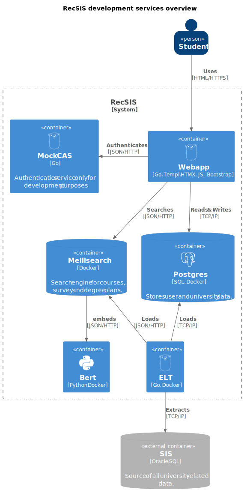

# System overview

The RecSIS consists of several docker containers and two standalone
applications. The responsibilities can be seen in the diagram below. It's worth
noting that RecSIS is planned to be deployed in production fully dockerized but
because rebuilding [webapp](#webapp) as a docker container is much slower,
the webapp is not dockerized as it is the main application and is rebuild quite
frequently in development. The second undockerized application
([Mock CAS](#mock_cas)) is a not used in production at all and the real
instance of [CAS](https://cas.cuni.cz/cas/login) is used instead.

## Search Engine

Even though we aim to use as little technologies as possible, some are
necessary to deliver the envisioned UX. Especially since search is a core
feature of RecSIS. After some experiments with PostgreSQL full text search
capabilities we decided to use [Meilisearch](https://www.meilisearch.com/)
because it is easy to set as opposed to, for example [Apache
Solr](https://solr.apache.org/), but still provides necessary features (e.g.
typo tolerance) as opposed to PostgreSQL. Meilisearch wasn't the only
possibility. [Typesense](https://typesense.org/) was another candidate but we
decided to go with younger Meilisearch because it looked more shiny.

## ELT

It's worth mentioning that to access SIS DB you need to be inside MFF network.
Therefore, a SSH tunnel to Acheron is set up inside the container. This is also why
you need access to Acheron server to run ELT.

## List of technologies

 - [Go](https://go.dev/) - The main language of the entire RecSIS. Should be a
 preferable choice for any implementation.
 - [HTMX](https://htmx.org/) - The core of HTMX is a set of attributes that
 allow you to issue AJAX requests directly from HTML. Brings SPA like experience
 to the SSR web apps.
 - [Templ](https://templ.guide/) - Compiler for HTML templates to minimize run
 time errors. Because the tooling is not the best we sometimes asking ourselves
 if it was a wise choice.
 - [Bootstrap](https://getbootstrap.com/) - Simple way to style web apps.
 - [Python](https://www.python.org/) - We use Python for creating BERT embeddings for courses. This is used by MeiliSearch for recommendations.
 - [PostgreSQL](https://postgresql.org/) - Relational database of our choice
 with rich support for binary JSON format.
 - [Meilisearch](https://meilisearch.com/) - Simple and powerful search engine.
 - [Docker](https://docker.com/) - To simplify development and deployment in
 production. In development using Docker not always simplifies things so we
 thinks it is ok to not use it but in production it is a must.
 - [Adminer](https://adminer.org/) - Web based DB client deployed as a
 container.